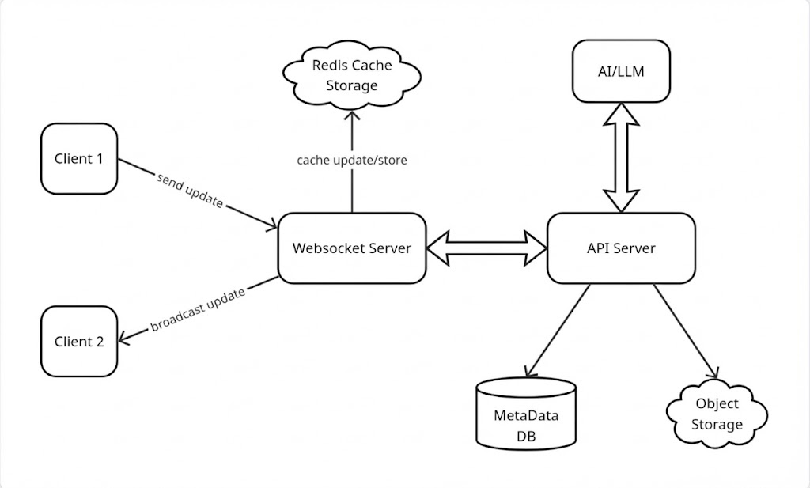

# LiveCode : A Collaborative Real-Time Code Editor for Teams

LiveCode is a web-based collaborative code editor where multiple users can work together in real time. Developers can join a shared workspace, write and edit code simultaneously, and see updates instantly. The platform includes a simple AI-powered autocomplete system to assist with faster and cleaner coding.

## Quick Start (Docker)

1. **Clone the repository**
   ```bash
   git clone https://github.com/rajathshttgr/livecode.git
   cd livecode
   ```
2. **Run with Docker Compose**

   ```bash
   docker compose up --build
   ```

3. **Access the Application**

   - **Frontend:** http://localhost:3000

   - **Backend API Docs:** http://localhost:8000/docs

4. **Stop the Application Press Ctrl+C in the terminal or run:**
   ```bash
   docker compose down
   ```

## Folder Structure

```
/frontend   # Next.js app
/backend    # FastAPI app
```

---

## Tech Stack

- **Frontend:** Next.js, JavaScript, Monaco Editor

- **Backend:** FastAPI, Python, WebSockets

- **Database:** PostgreSQL 16 (Persistence)

- **Real-time Engine:** Redis (Pub/Sub & Cache)

## System Architecture



For a comprehensive breakdown of the system design, including architectural decisions and iteration history, please refer to the [Backend Documentation](backend/README.md).
